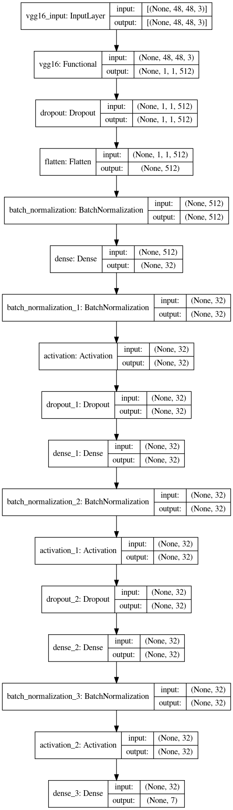
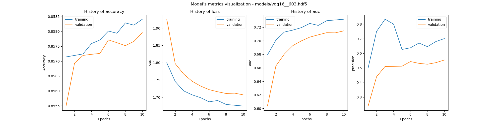
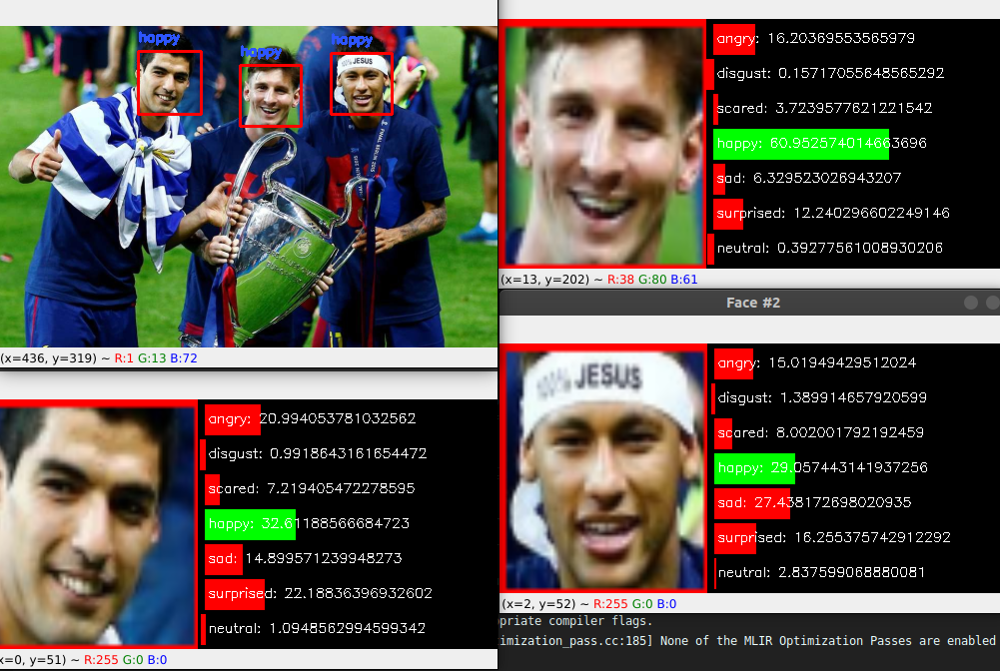

# Emotion-recognition
Emotion recognition using the transfer learning method.

### <ins>Models</ins>
I have used 2 models : a haar cascade one and another that was based on the VGG16 architecture. 

#### _haarcascade_frontalface_default.xml_

Why a Haar cascade ? 
- It is lightweight
- It is super fast, even on resource-constrained devices
- The Haar cascade model size is tiny (for our model, we are talking about 930 KB)

Yes, there are several problems with Haar cascades, especially that they are prone to false-positives detections and less accurate results in comparasion with other face recognition models. 

__But the Haar cascades are still very useful and practical, especially on resource-constrained devices.__

#### _Architecture of the VGG16 model_
For the model training, I used the VGG16 CNN architecture. Most unique thing about VGG16 is that instead of having a large number of hyper-parameter the creators focused on having convolution layers of 3x3 filter with a stride 1 and always used the same padding and maxpool layer of 2x2 filter of stride 2.

This is how tha architecture really looks like with all the layers:


### <ins>Training</ins>

The training of this model can be done by typing this command: 
```shell script
python train_vgg16.py
```

#### _About the database_
I have used the [FER-2013]("https://www.kaggle.com/datasets/msambare/fer2013") database. The data consists of 48x48 pixel grayscaled images of faces. The faces have been automatically registered so that the ace is more or less centred and occupies about the same amount of space in each image.

The database was built to categorize faces based on the emotion shown in the facial expression into one of the seven categories :
- 0 - angry
- 1 - disgust
- 2 - fear
- 3 - happy
- 4 - sad 
- 5 - surprise
- 6 - netural


The training set consists of 28,709 examples and the public test set consists of 3,589 examples.

#### _Callbacks_
A callback is a set of functions to be applied at given stages of the training procedure. You can use callbacks to get a view on internal states and statistics of the model during training.

The callbacks that I have used can be seen on line 90, in [train_vgg16.py](train_vgg16.py) file. Those are : 
- <ins>[__ReduceLROnPlateau__](https://keras.io/api/callbacks/reduce_lr_on_plateau/)</ins> - Reduce learning rate when a metric has stopped improving.
- <ins>[__ModelCheckpoint__](https://keras.io/api/callbacks/model_checkpoint/)</ins> - This callback saves the model after every epoch.
- <ins>[__EarlyStopping__](https://keras.io/api/callbacks/early_stopping/)</ins> - One way to avoid overfitting is to terminate the process early. The EarlyStoppingfunction has various metrics/arguments that you can modify to set up when the training process should stop.

#### _Metrics_
Evaluating the model was essential to understand where I could improve. Most of the time, we use classification accuracy to measure the performance of our model, however it is not enough to truly judge our model.

The metrics that I have used were: 
- <ins>[__Binary Accuracy__](https://www.tensorflow.org/api_docs/python/tf/keras/metrics/BinaryAccuracy)</ins> - Calculates how often predictions match binary labels. 
- <ins>[__Precision__](https://www.tensorflow.org/api_docs/python/tf/keras/metrics/Precision)</ins> - Computes the precision of the predictions with respect to the labels.
- <ins>[__Recall__](https://www.tensorflow.org/api_docs/python/tf/keras/metrics/Recall)</ins> - Computes the recall of the predictions with respect to the labels.
- <ins>[__AUC__](https://www.tensorflow.org/api_docs/python/tf/keras/metrics/AUC)</ins> - Approximates the AUC (Area under the curve) of the ROC or PR curves.

#### _Comparasions_

During the development of this project, I have tried to train more models, and always aimed for better results. 

To be able to understand the training of each model, I had developed a way to save details about training. 

Those details can be found in the [charts.py](utils/charts.py) file. In this file there are 2 functions: 
- ```writeLogFile()``` - Wrote all the details of the training in a markdown file.
- ```trainValidationPlot()``` - Creates a chart that compares the training and the validation using our predefined metrics.

A chart looks something like this: 


#### _Final results_

The best model that I had been able to train, was [face_recog_vgg_856.hdf5](models/face_recog_vgg_856.hdf5). It has an accuracy of 85,6%. Unfortunately, I did not create the method to save details about the training when I have trained this model.

### <ins>Detection on real time video</ins>
This file will do detection on the video feed from the webcam of a laptop or an external camera.

__In case I want to use a webcam, I will have to change the port on the [real_time_video.py](real_time_video.py), line 104. See the [detect-webcams.py](utils/detect-webcam.py) file for more details.__

This file will take continuous frames from the webcam, and process each one individually. For each processed frame, it will find all the emotions and show the results. 

#### About the preprocessing

The emotion that has the highest percentage will be shown as the primary emotion for that face. 


To run this file, we cam simply type this command.
```shell script
python real_time_video.py
```

Result: 

### <ins>Detection on pictures</ins>
This file will do the recognition on a given picture.

It is the exactly same process that we have done for each frame in the [real_time_video.py](real_time_video.py).

We can run this command to see how this file works:
```shell script
python pictures_detection.py --image images/msn.png
```

Result:


#### _Argparsing / command line arguments_
Command line arguments are flags given to a program/script at runtime. They contain additional information for our program so that it can execute.

We use command line arguments because it allows us to give our program different input on the fly without changing the code.

Let's take as an example this file ```argparse_example.py```:
```python
# importing the necessary package
import argparse

# constructing the argument parse and parsing the argument
ap = argparse.ArgumentParser()
ap.add_argument("-n", "--name", required=True, help="name of the user")
args = vars(ap.parse_args())

# displaying a friendly message
print(f"Hi {args['name']} !")
```

If we will run this command, it will print what we parsed through the command line:
```shell script
python argparse_example.py --name John
```

### <ins>Coding</ins>
All the code was written in the Python 3.6 programming language. All the libraries that I have used are in the [requirements.md](requirements.md) file, alongside with all of their versions.

__As a disclaimer, the only accepted versions for TensorFlow are those that start from 2.6.0 and above. Rest of the versions do not really matter.__